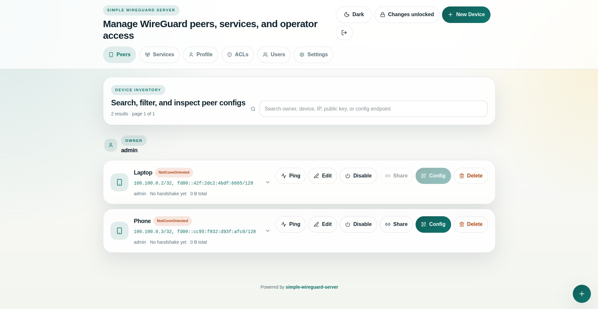
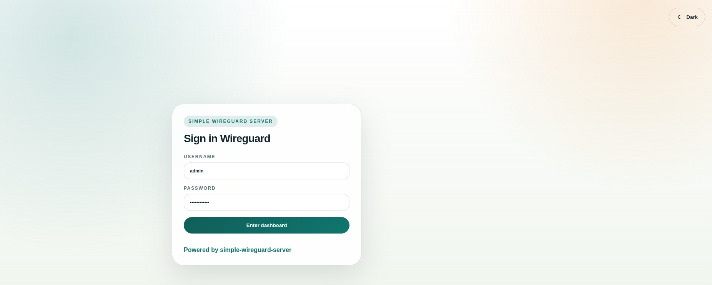

# Simple WireGuard Server

Run a WireGuard server, relay hub, protected service edge, and browser-managed
control plane without hand-editing YAML.

`uwgsocks-ui` is the browser UI and management daemon for
[userspace-wireguard-socks](https://github.com/reindertpelsma/userspace-wireguard-socks).
It manages `uwgsocks` by default and can switch to `uwgkm` when you want kernel
WireGuard on Linux.

From the operator perspective, this is what it buys you:

- create users and peer configs from the browser
- manage ACLs, forwards, transports, and live daemon updates without editing files
- publish protected internal services through login-gated subdomains
- expose `/proxy` and `/socket` access paths for browsers, tooling, and app-sidecars
- run rootless by default on top of `uwgsocks`, without Docker privileges or host route surgery
- host a managed TURN daemon and issue per-user TURN credentials from the same UI



## Install

Install the data plane from the main `uwgsocks` repository:

```bash
curl -fsSL https://raw.githubusercontent.com/reindertpelsma/userspace-wireguard-socks/main/install.sh | sh -s -- uwgsocks
curl -fsSL https://raw.githubusercontent.com/reindertpelsma/userspace-wireguard-socks/main/install.sh | sh -s -- turn
```

Install the UI from this repository:

```bash
curl -fsSL https://raw.githubusercontent.com/reindertpelsma/simple-wireguard-server/main/install.sh | sh -s -- uwgsocks-ui
```

Optional kernel-mode manager for Linux:

```bash
curl -fsSL https://raw.githubusercontent.com/reindertpelsma/simple-wireguard-server/main/install.sh | sh -s -- uwgkm
```

Windows install:

```powershell
curl.exe -fsSLo install.bat https://raw.githubusercontent.com/reindertpelsma/simple-wireguard-server/main/install.bat
install.bat
```

Build from source:

```bash
./compile.sh
```

Source builds need:

- Go 1.25+
- Node.js 20.19+ for the frontend build

Windows:

- use the release page binaries, or
- run `install.bat` / `install.ps1`

Release tags also publish:

- `ghcr.io/reindertpelsma/simple-wireguard-server:<tag>`

## First Start

```bash
uwgsocks-ui -listen 0.0.0.0:8080
```

On first startup the UI:

- creates `wgui.db`
- generates `wgui_secrets.json`
- prints a random admin password
- prints a bootstrap WireGuard client config by default
- starts and manages `uwgsocks` as a child daemon unless `-manage=false`

Then open `http://YOUR-HOST:8080/login`, sign in with the bootstrap admin
credentials, and start creating users, peers, ACLs, and services.



## Documentation

Start with the guided flow:

- [How-To Index](docs/howto/README.md)
- [01 Install And Bootstrap](docs/howto/01-install-and-bootstrap.md)
- [02 Users And Client Configs](docs/howto/02-users-and-client-configs.md)
- [03 Groups And ACLs](docs/howto/03-groups-and-acls.md)
- [04 Services And Public Ingress](docs/howto/04-services-and-public-ingress.md)
- [05 Browser Proxy And Socket Access](docs/howto/05-browser-proxy-and-socket-access.md)
- [06 Reverse Proxy And TLS](docs/howto/06-reverse-proxy-and-tls.md)
- [07 OIDC Login](docs/howto/07-oidc-login.md)
- [08 Kernel Mode With Uwgkm](docs/howto/08-kernel-mode-with-uwgkm.md)
- [09 Managed TURN Hosting](docs/howto/09-managed-turn-hosting.md)

Deep reference docs:

- [UI config reference](docs/reference/config-reference.md)
- [CLI and environment reference](docs/reference/cli-reference.md)
- [Reverse proxy reference](docs/reference/reverse-proxy.md)
- [Uwgkm mode reference](docs/reference/uwgkm.md)
- [Managed TURN hosting reference](docs/reference/turn-hosting.md)
- [Managed daemon configuration reference](docs/reference/daemon-configuration.md)
- [Proxy and routing behavior](docs/reference/proxy-routing.md)
- [Socket protocol](docs/reference/socket-protocol.md)
- [Testing](docs/reference/testing.md)
- [OpenAPI schema](docs/reference/openapi.yaml)

## Platform Status

- Supported and repeatedly tested: Linux, macOS, Windows, FreeBSD
- Linux-only component: `uwgkm`
- OpenBSD source builds currently depend on reusing a prebuilt `dist/`

See [docs/reference/testing.md](docs/reference/testing.md) for the current test
surface and platform notes.

## License

ISC License. See [LICENSE](LICENSE) for details.
