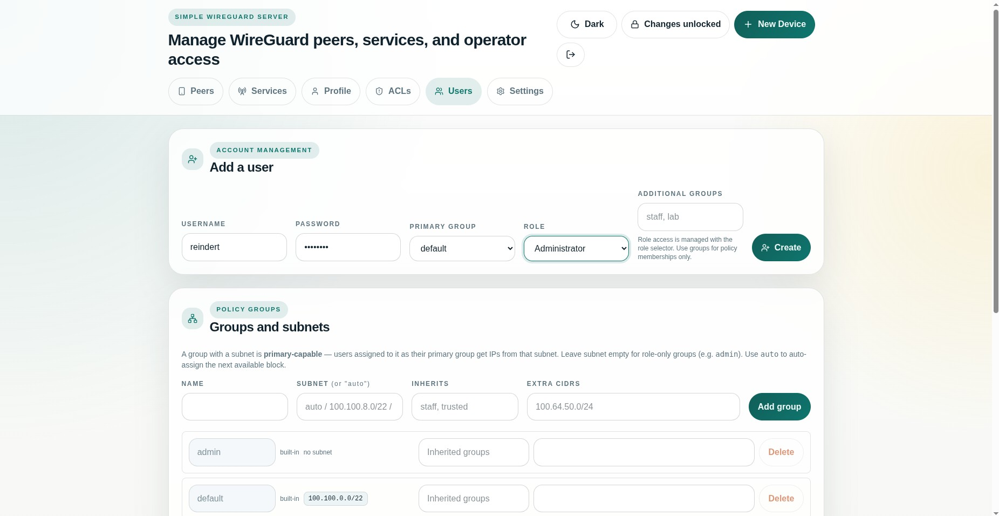
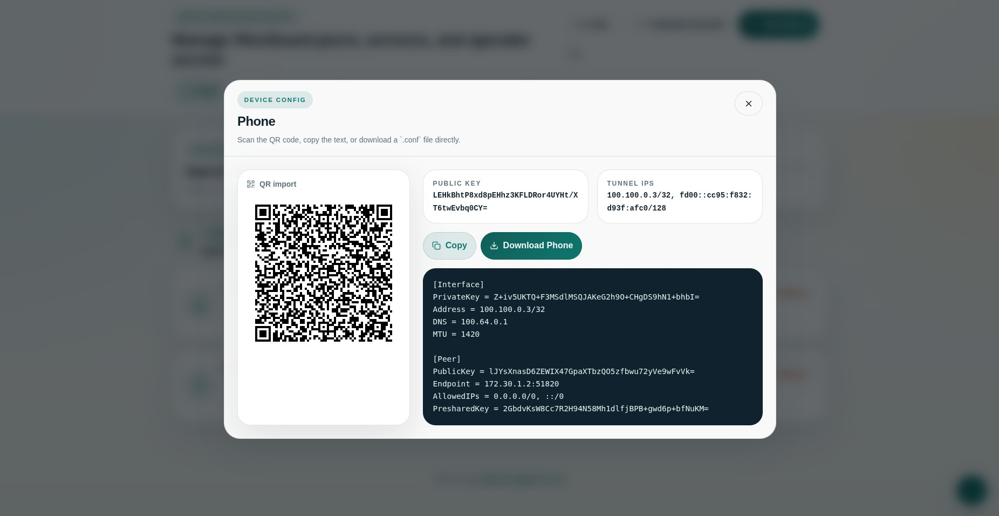

<!-- Copyright (c) 2026 Reindert Pelsma -->
<!-- SPDX-License-Identifier: ISC -->

# 02 Users And Client Configs

Previous: [01 Install And Bootstrap](01-install-and-bootstrap.md)  
Next: [03 Groups And ACLs](03-groups-and-acls.md)

The normal flow is user first, then one or more peers under that user.

## Create A User

From the browser:

1. open the users or peers section
2. create a user account for the person or workload owner
3. create a peer under that user

The UI stores:

- the user identity
- the peer public key
- optional encrypted private key material
- optional policy tags

## Download A Client Config

Each peer config is generated from:

- the server endpoint
- the selected default transport
- the `client_allowed_ips` setting
- the client DNS and MTU settings
- optional `#!` directives such as `#!TURN=`, `#!URL=`, and `#!TCP=`

That means the downloaded config is already transport-aware for `uwgsocks`
clients, instead of being limited to plain WireGuard UDP.

## What The UI Decides For You

The UI automatically:

- allocates tunnel addresses
- picks the right server public key
- includes preshared keys when enabled
- appends `#!` directives when the server is configured for TURN, URL transport, or TCP mode
- publishes extra client transport profiles such as `/socket` when enabled

## When To Use Shared Links

Use shared links when:

- you want a user to fetch a config without opening the full admin UI
- you want a short-lived distribution link
- you want to avoid copying raw config text into chat or email

See [../reference/config-reference.md](../reference/config-reference.md) for the
visibility and encryption-related settings that control this behavior.
