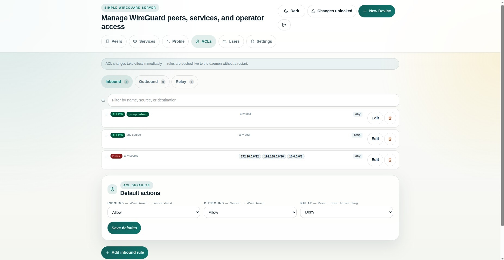

<!-- Copyright (c) 2026 Reindert Pelsma -->
<!-- SPDX-License-Identifier: ISC -->

# 03 Groups And ACLs

Previous: [02 Users And Client Configs](02-users-and-client-configs.md)  
Next: [04 Services And Public Ingress](04-services-and-public-ingress.md)

Groups and ACLs are the policy layer. They decide who can reach what after a
peer is already connected.

## Groups

The UI creates built-in groups such as:

- `default`
- `admin`
- `moderator`

It can also auto-assign per-group subnets from the configured IPv4 and IPv6
group pools.

Use groups when you want:

- one subnet slice per team or environment
- easier ACL expressions than raw peer IPs
- user and peer defaults that survive peer rotation

## ACLs

The UI pushes ACLs live into the managed daemon. You can control:

- inbound default action
- outbound default action
- relay default action
- explicit allow and deny rules

Typical pattern:

1. leave defaults restrictive enough for your environment
2. create allow rules between the groups that should talk
3. publish only the services that should cross trust boundaries

## Policy Tags

Tags let you express access in terms of roles instead of hard-coded IPs.

Useful examples:

- `prod`
- `staging`
- `ops`
- `support`
- `db-admin`

The UI expands those tags into the effective ACL rules before syncing them to
`uwgsocks`.
