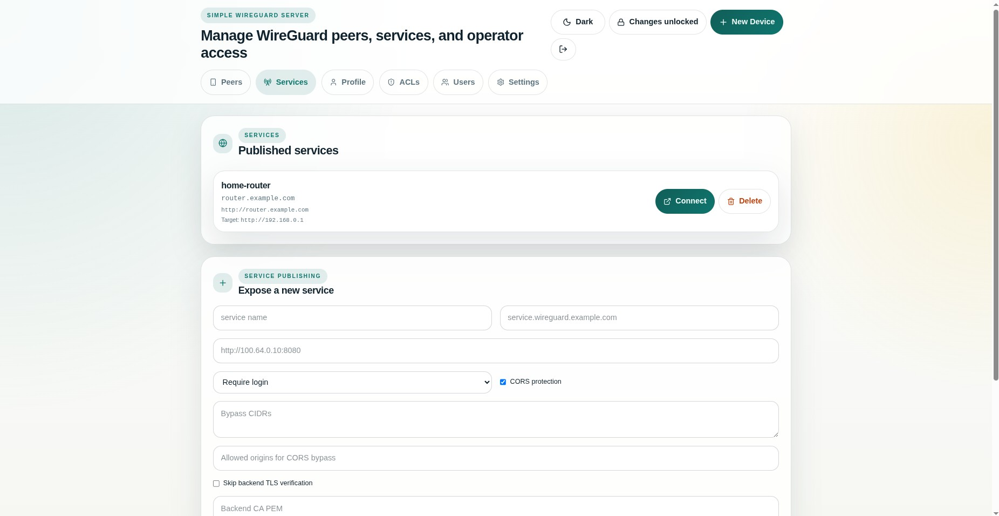

<!-- Copyright (c) 2026 Reindert Pelsma -->
<!-- SPDX-License-Identifier: ISC -->

# 04 Services And Public Ingress

Previous: [03 Groups And ACLs](03-groups-and-acls.md)  
Next: [05 Browser Proxy And Socket Access](05-browser-proxy-and-socket-access.md)

This is the “publish one internal service safely” flow.



## What An Exposed Service Does

An exposed service maps a protected hostname on the UI server to a backend
service behind the managed WireGuard network.

That gives you:

- login-gated service publishing
- one browser entry point for internal apps
- no need to expose the private backend directly on the public Internet

## Typical Flow

1. create a backend peer or route that can reach the internal service
2. add an exposed service entry in the UI
3. bind it to the hostname you want to publish
4. place the UI behind a reverse proxy with TLS
5. let users log in before they reach the backend

The request path is:

```text
browser -> reverse proxy -> uwgsocks-ui -> protected service reverse proxy -> backend over WireGuard
```

## Subdomain Publishing

This is where `simple-wireguard-server` becomes the public edge for a private
service mesh:

- the UI handles login and session cookies
- the backend service stays on the private side
- the outer hostname can still look like a normal web app

If you want public-facing ingress, read
[06 Reverse Proxy And TLS](06-reverse-proxy-and-tls.md) next.
