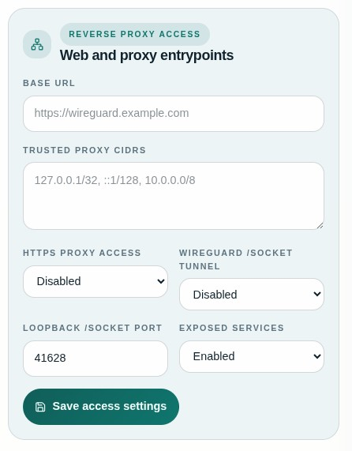
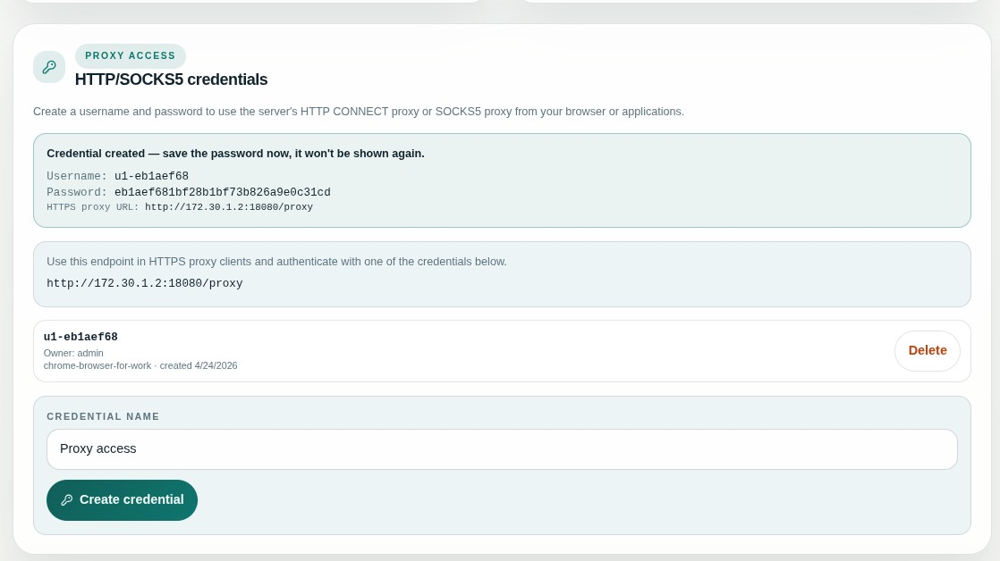

<!-- Copyright (c) 2026 Reindert Pelsma -->
<!-- SPDX-License-Identifier: ISC -->

# 05 Browser Proxy And Socket Access

Previous: [04 Services And Public Ingress](04-services-and-public-ingress.md)  
Next: [06 Reverse Proxy And TLS](06-reverse-proxy-and-tls.md)

The UI can expose two browser and tooling access paths on the same origin:

- `/proxy`
- `/socket`

## `/proxy`

`/proxy` is the authenticated HTTP CONNECT path.

Use it when you want:

- browser tooling through one HTTPS origin
- user-specific proxy credentials
- a managed alternative to handing out raw loopback proxy ports

## `/socket`

`/socket` is the single-domain socket-upgrade path that lets clients talk to
the managed `uwgsocks` socket API through the UI host.

Use it when you want:

- a clean HTTPS URL for client transport profiles
- one public origin instead of separate daemon URLs
- a browser-friendly or app-friendly control/data path on the same host

## When To Turn These On

Enable `/proxy` when users or tools need HTTP CONNECT through the managed mesh.

Enable `/socket` when you want the UI hostname itself to become a transport
profile endpoint for generated configs.

Both are documented in more depth in:

- [../reference/config-reference.md](../reference/config-reference.md)
- [../reference/reverse-proxy.md](../reference/reverse-proxy.md)
