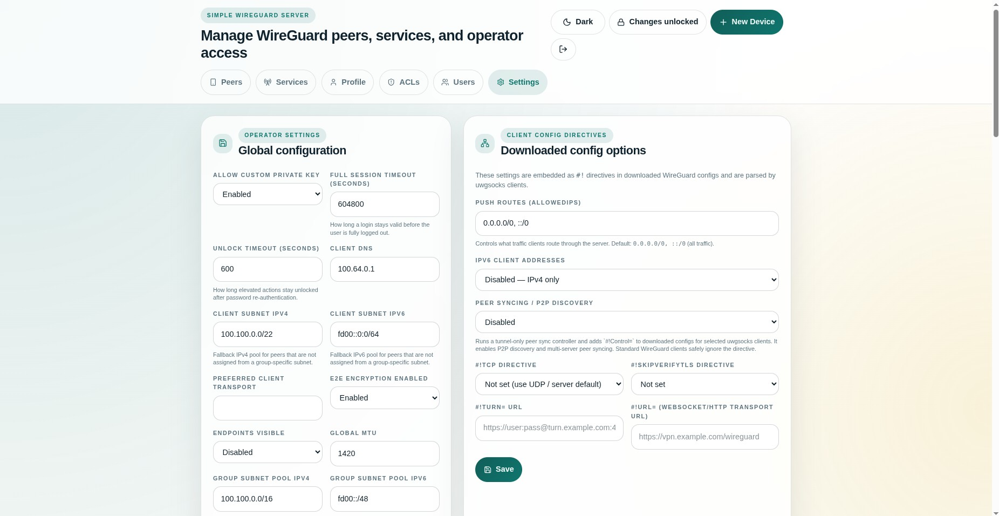

<!-- Copyright (c) 2026 Reindert Pelsma -->
<!-- SPDX-License-Identifier: ISC -->

# 06 Reverse Proxy And TLS

Previous: [05 Browser Proxy And Socket Access](05-browser-proxy-and-socket-access.md)  
Next: [07 OIDC Login](07-oidc-login.md)

Most real deployments should put `uwgsocks-ui` behind a reverse proxy.



## Why

The reverse proxy should own:

- public TLS certificates
- hostname routing
- HSTS and other web edge headers
- optional OIDC middleware if you want it there too

The UI should stay focused on:

- session handling
- service publishing
- daemon management
- peer and ACL administration

## Important Settings

Set these correctly when you are behind a proxy:

- `trusted_proxy_cidrs`
- `web_base_url`

Without them:

- client IP logging can be wrong
- redirect URLs can be wrong
- generated transport profile URLs can be wrong
- OIDC callback URLs can be wrong

## Recommended Pattern

Run:

```text
public TLS reverse proxy -> uwgsocks-ui on loopback or private LAN
```

Then set:

- `web_base_url` to the public `https://` URL
- `trusted_proxy_cidrs` to the proxy or load balancer source ranges

See [../reference/reverse-proxy.md](../reference/reverse-proxy.md) for the
deployment details and trust model.
