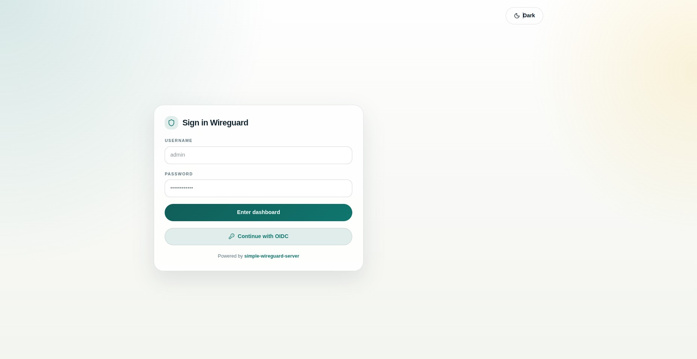

<!-- Copyright (c) 2026 Reindert Pelsma -->
<!-- SPDX-License-Identifier: ISC -->

# 07 OIDC Login

Previous: [06 Reverse Proxy And TLS](06-reverse-proxy-and-tls.md)  
Next: [08 Kernel Mode With Uwgkm](08-kernel-mode-with-uwgkm.md)

OIDC is the right move when the UI should join your existing identity stack.



## Start With These Flags

```bash
uwgsocks-ui \
  -listen 0.0.0.0:8080 \
  -oidc-issuer https://login.example.com/realms/main \
  -oidc-client-id uwgsocks-ui \
  -oidc-client-secret change-me
```

Optional:

```bash
-oidc-redirect-url https://wireguard.example.com/api/oidc/callback
```

If `-oidc-redirect-url` is omitted, the UI derives the callback from
`web_base_url` or from the request host.

## What Happens

On successful login, the UI:

- exchanges the authorization code with the provider
- fetches userinfo
- creates or updates a local UI user
- binds that user to the OIDC provider and subject

That means you still get local ownership of peers, ACLs, service access, and
TURN credentials while deferring identity to your IdP.
