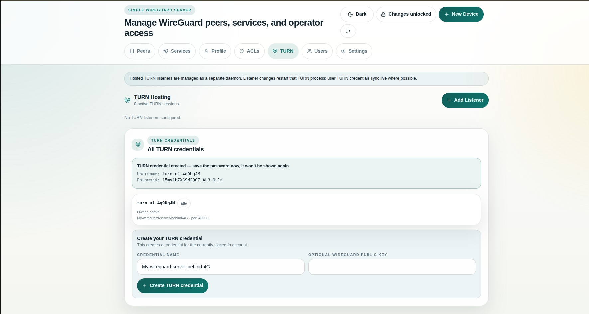
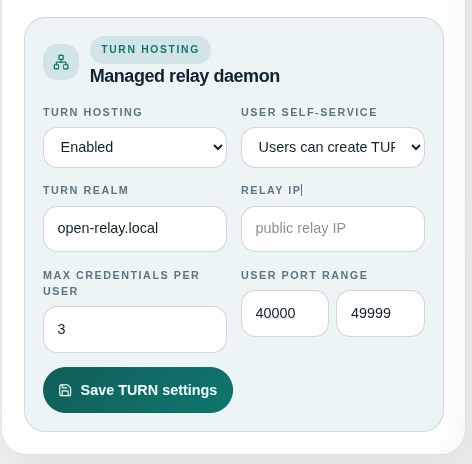

<!-- Copyright (c) 2026 Reindert Pelsma -->
<!-- SPDX-License-Identifier: ISC -->

# 09 Managed TURN Hosting

Previous: [08 Kernel Mode With Uwgkm](08-kernel-mode-with-uwgkm.md)

Managed TURN hosting lets the UI issue TURN credentials and control the TURN
daemon that fronts your private WireGuard or application traffic.

## What It Is For

Use managed TURN hosting when:

- peers are behind NAT or restrictive firewalls
- you want a relay path that still looks like normal TURN/WebRTC-style traffic
- you want the browser UI to issue per-user TURN credentials

## What The UI Manages

- TURN listeners
- TURN realm and relay IP
- per-user TURN credentials
- optional self-service TURN credential creation
- the managed `turn` child daemon

## Relationship To `uwgsocks`

The UI does not replace `uwgsocks`. It coordinates:

- `uwgsocks` for the WireGuard control and data plane
- `turn` for public relay ingress when direct reachability is missing

See [../reference/turn-hosting.md](../reference/turn-hosting.md) for the full
listener and credential model.
